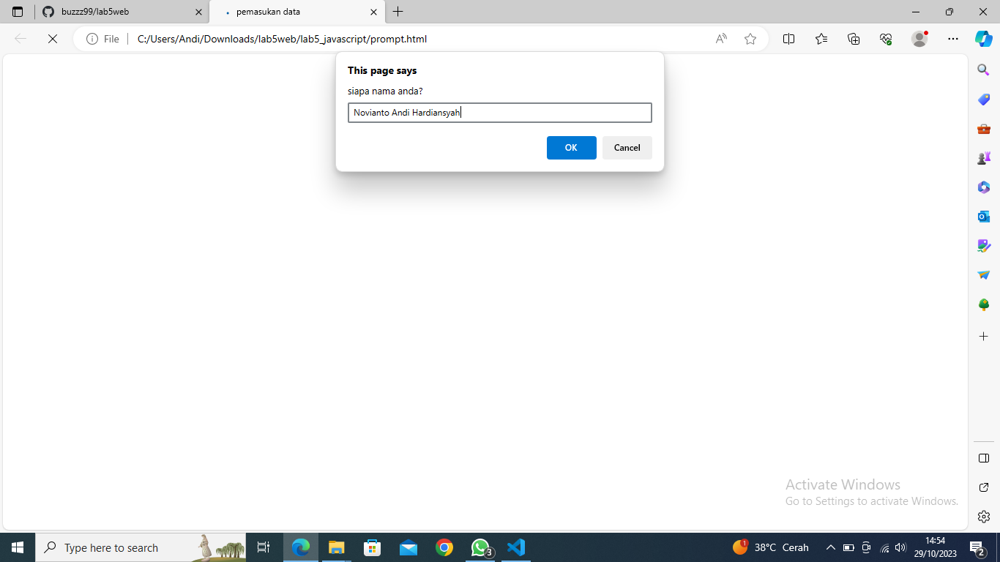
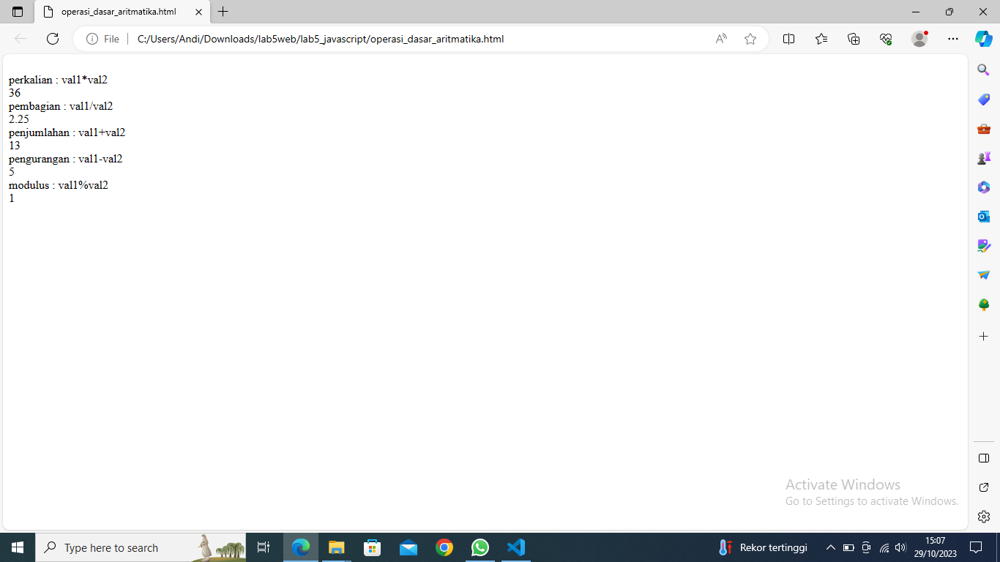

# Lab5Web
# Nama : Novianto Andi Hardiansyah
# NIM : 312210316
# Kelas : TI.22.A3

## Instruksi Praktikum
1. Persiapkan text editor misalnya VSCode.
2. Buat folder baru dengan nama ```lab5_javascript```.
3. Ikuti langkah-langkah praktikum yang akan dijelaskan berikutnya.
4. Lakukan validasi dokumen html dengan mengakses http://validator.w3.org
## Langkah-langkah Praktikum
* Persiapan membuat dokumen HTML dengan nama file ```lab5_javascript.html```seperti berikut.

* Hasil Output

## Javascript Dasar
* Pemakaian ```Alert``` sebagai property window.

* Hasil Output

* Pemakaian ```method``` dalam objek.

* Hasil Output

* Pemakaian ```Prompt```

* Hasil Output


* Pembuatan ```fungsi``` dan cara pemanggilannya

## Dasar Pemrograman Di Javascript
* Operasi dasar ```aritmatika```

* Hasil Output

* Seleksi ```kondisi``` (if..else)

* Hasil Output


* Penggunaan ```operator switch``` untuk seleksi kondisi

* Hasil Output


## Pembuatan Form
* Form ```Input```

* Hasil Output


* Form ```Button```

* Hasil Output

## HTML ```DOM```
* Pilihan menggunakan ```checkBox``` dengan perhitungan otomatis

* Hasil Output

## Pertanyaan dan Tugas
1. ```Buat script untuk melakukan validasi pada isian form.```


* Hasil Output

## Laporan Praktikum
1. Buatlah repository baru dengan nama ```Lab5Web```.
2. Kerjakan semua latihan yang diberikan sesuai urutannya.
3. Screenshot setiap perubahannya.
4. Buatlah file README.md dan tuliskan penjelasan dari setiap langkah praktikum beserta
screenshotnya.
5. Commit hasilnya pada repository masing-masing.
6. Kirim URL repository pada e-learning ecampus